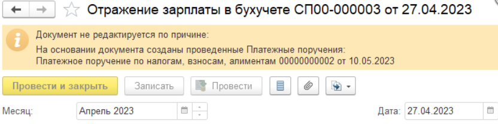
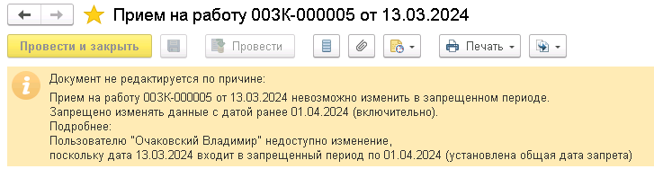

## Общие сведения

Если в типовой конфигурации есть модули **БлокировкаИзмененияОбъектов** тогда блокировка форм должна осуществляться через этот механизм.


Если подключается дата запрета к новому документу, нужно не забыть подключить блокировку форм.


## Подготовка формы

**ПриСозданииНаСервере**:

```bsl
БлокировкаИзмененияОбъектов.ПриСозданииНаСервереФормыОбъекта(Форма, Отказ, СтандартнаяОбработка);
```

**ПриЧтенииНаСервере**:

```bsl
БлокировкаИзмененияОбъектов.ПриЧтенииНаСервереФормыОбъекта(Форма, ТекущийОбъект);
```

**ПослеЗаписиНаСервере:**

```bsl
БлокировкаИзмененияОбъектов.ПослеЗаписиНаСервереФормыОбъекта(Форма, ТекущийОбъект, ПараметрыЗаписи);
```

**Модуль формы:**

```bsl
&НаКлиенте
Процедура Подключаемый_РазблокироватьФормуОбъекта(Команда)

    БлокировкаИзмененияОбъектовКлиент.РазблокироватьФормуОбъекта(ЭтотОбъект, Объект.Ссылка);

КонецПроцедуры
```

## Подключение

Для подключения нужно:

1. Создать свой модуль **прфБлокировкаИзмененияОбъектов**.
2. Создаем модуль **прфБлокировкаИзмененияОбъектовПовтИсп**.
3. В методе **БлокировкаИзмененияОбъектовРасширенный.ПараметрыБлокировкиИзмененияОбъекта** подключить наш модуль:

   ```bsl
   // Иванов И.И. 11.01.2024 {
   ТипСтрокой = XMLТип(ТипЗнч(СсылкаНаОбъект)).ИмяТипа;
   Если прфБлокировкаИзмененияОбъектовПовтИсп.ДоступныТиповыеБлокировки(ТипСтрокой) Тогда
       КоллекцияБлокировок = БлокировкаИзмененияОбъектовБазовый.ПараметрыБлокировкиИзмененияОбъекта(СсылкаНаОбъект, УправляемаяФорма);
   Иначе
       КоллекцияБлокировок = прфБлокировкаИзмененияОбъектов.ПараметрыБазовойБлокировкиИзмененияОбъекта(СсылкаНаОбъект, УправляемаяФорма);
   КонецЕсли;
   // }Иванов И.И. 11.01.2024

   // Иванов И.И. 11.01.2024 {
   прфБлокировкаИзмененияОбъектов.ДобавитьБлокировкуИзмененияОбъекта(КоллекцияБлокировок, СсылкаНаОбъект, УправляемаяФорма);
   // }Иванов И.И. 11.01.2024
   ```

## Добавление проверок

### Пример модуля **прфБлокировкаИзмененияОбъектов** со своими проверками

```bsl
#Область СлужебныйПрограммныйИнтерфейс

Процедура ДобавитьБлокировкуИзмененияОбъекта(КоллекцияБлокировок, СсылкаНаОбъект, УправляемаяФорма) Экспорт

    ТипОбъекта = ТипЗнч(СсылкаНаОбъект);

    Если ТипОбъекта = Тип("ДокументСсылка.ЭтапПроизводства2_2") тогда
        ДобавитьБлокировкиЭтапаПроизводства(КоллекцияБлокировок, СсылкаНаОбъект, УправляемаяФорма);
    КонецЕсли;

КонецПроцедуры

Функция ПараметрыБазовойБлокировкиИзмененияОбъекта(СсылкаНаОбъект, УправляемаяФорма) Экспорт

    КоллекцияБлокировок = Новый Массив;
    МетаданныеОбъекта = СсылкаНаОбъект.Метаданные();
    Если Не ПравоДоступа("Изменение", МетаданныеОбъекта) Тогда
        БлокировкаИзмененияОбъекта = БлокировкаИзмененияОбъектов.ОписаниеБлокировкиИзмененияОбъекта("ПраваИзмененияОбъекта",
        НСтр("ru = 'Нет прав на изменение'"), Ложь);
        КоллекцияБлокировок.Добавить(БлокировкаИзмененияОбъекта);
    Иначе
        ОписаниеРезультата = "";
        ИзменениеЗапрещено = ДатыЗапретаИзменения.ИзменениеЗапрещено(МетаданныеОбъекта.ПолноеИмя(), СсылкаНаОбъект , ОписаниеРезультата);
        Если ИзменениеЗапрещено Тогда
            Если Не ПустаяСтрока(ОписаниеРезультата) Тогда
                ОписаниеРезультата = СокрЛП(ОписаниеРезультата);
                ОписаниеРезультата = СтрЗаменить(ОписаниеРезультата, Символы.ПС + Символы.ПС, Символы.ПС);
                БлокировкаИзмененияОбъекта = БлокировкаИзмененияОбъектов.ОписаниеБлокировкиИзмененияОбъекта("ДатыЗапретаИзменения", ОписаниеРезультата,
                Ложь, НСтр("ru = 'Необходимо изменить или совсем отключить дату запрета изменения данных, обратитесь к Администратору.'"));
                КоллекцияБлокировок.Добавить(БлокировкаИзмененияОбъекта);
            КонецЕсли;
        КонецЕсли;
    КонецЕсли;

    Возврат КоллекцияБлокировок;

КонецФункции

#КонецОбласти

#Область СлужебныеПроцедурыИФункции

Процедура ДобавитьБлокировкиЭтапаПроизводства(КоллекцияБлокировок, СсылкаНаОбъект, УправляемаяФорма)

    Если Не ЗначениеЗаполнено(СсылкаНаОбъект) Тогда
        Возврат;
    КонецЕсли;

    ДокументПриостановлен = УправляемаяФорма.прфПриостановлен;

    ПроверитьПравоРедактированияПриостановленногоДокументаПартии(КоллекцияБлокировок, СсылкаНаОбъект, ДокументПриостановлен);

КонецПроцедуры

#Область Проверки

Процедура ПроверитьПравоРедактированияПриостановленногоДокументаПартии(КоллекцияБлокировок, СсылкаНаОбъект, ДокументПриостановлен)

    Если Не (Не УправлениеДоступом.ЕстьРоль("прфРедактироватьПриостановленныеПартииПроизводства")
        И ДокументПриостановлен) Тогда
        Возврат;
    КонецЕсли;

    Комментарий = НСтр("ru = 'Нет прав для редактирования приостановленного документа'");

    БлокировкаИзмененияОбъекта = БлокировкаИзмененияОбъектов.ОписаниеБлокировкиИзмененияОбъекта(
        "прфРедактироватьПриостановленныеПартииПроизводства",
        Комментарий,
        Ложь,
        Комментарий);

    КоллекцияБлокировок.Добавить(БлокировкаИзмененияОбъекта);

КонецПроцедуры

#КонецОбласти

#КонецОбласти
```

### Модуль **прфБлокировкаИзмененияОбъектовПовтИсп**

```bsl
#Область СлужебныеПроцедурыИФункции

Функция ДоступныТиповыеБлокировки(ИмяТипа) Экспорт

    ТипЗначения = Тип(ИмяТипа);
    ТипыИсключений = Новый Массив;
    ТипыИсключений.Добавить(Тип("ДокументСсылка.прфРегистрацияДнейЗагранкомандировка"));

    Возврат ТипыИсключений.Найти(ТипЗначения) = Неопределено;

КонецФункции

#КонецОбласти
```
