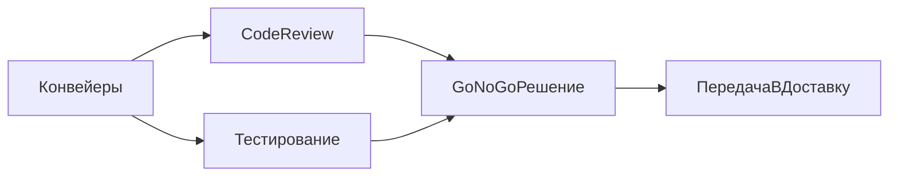

## Обзор

Эта документация содержит информацию о CI/CD процессах, настройке SonarQube, дымовых тестах и конфигурации pipeline.

## Как читать раздел

- `Конвейеры` — общий CI-регламент и инструментальные профили.
- `Тестирование` — состав проверок, артефакты и инициализация данных.
- `Code-review` — правила MR, ревью и повторных циклов проверки.
- `Доставка и развертывание` — правила доставки и выкладки в контуры.

## Содержание

- [Code-review](code-review/README.md)
- [Конвейеры](pipelines/README.md)
- [Тестирование](testing/README.md)
- [Доставка и развертывание](delivery/README.md)
- [SonarQube](sonar/README.md)
