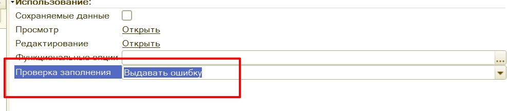
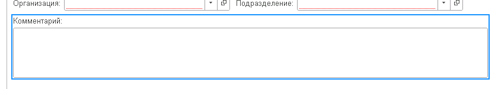
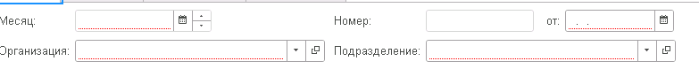

## Общие сведения

Все доработки типовых форм осуществляются программным способом.
Опирайтесь на стандарты от компании 1С: [проектирование интерфейсов](https://its.1c.ru/db/v8std#browse:13:-1:7)

При проектировании формы проверяйте не только техническое размещение реквизитов, но и сценарий пользователя: какие действия выполняются чаще всего, какие поля меняются редко, где требуется подсказка, а где достаточно понятного заголовка.

## Форма объекта

### Общие

1. При разработке команд на форме не забывать про галку **«Изменяет сохраняемые данные»**, так как автоматом не будет взведен флаг **Модифицированность** и при установке форме свойства **ТолькоПросмотр** кнопка останется активной.
2. У страницы с табличной частью должно быть заполнено свойство **ПутьКДаннымЗаголовка** (Объект.Товары.КоличествоСтрок).
3. Стараться проверять на заполнение реквизитов формы через установку свойства **«Проверка заполнения»**:



Проверка в коде будет следующим образом:

```bsl
Если Не ПроверитьЗаполнение() Тогда
    Возврат;
КонецЕсли;
```

### Новые объекты

1. Формы объектов должны придерживаться стилистики типовых объектов (пример **ERP**).
2. Для документов следовать стандартам раздела [Формы документов.](https://its.1c.ru/db/v8std#browse:13:-1:7:9)
3. Для документов функционал подбора включается в разработку по умолчанию, вне зависимости от наличия указания в техническом задании, если иное не оговорено отдельно.
4. Разделять реквизиты шапки и табличных частей на отдельные вкладки: Основное (реквизиты шапки), Товары (табличная часть товары).
5. [Правила компоновки форм](https://its.1c.ru/db/v8std#content:722:hdoc).

### Типовые объекты

1. Все доработки типовых форм осуществляются программным способом. Используется функционал типовых конфигураций, например для **Управление холдингом** это **УправлениеФормойУХ**.
2. Если на форме есть страница с вкладками тогда новые реквизиты размещаются на новую вкладку **прфСтраницаСпециальная (Специальная)** при условии, что в ТЗ не прописано явное расположение.
3. Если на форме нет вкладок тогда создается новая служебная группа **прфГруппаСпециальная** без заголовка и выделений. Внутри новой группы уже размещаются новые элементы. При условии, что в ТЗ не прописано явное расположение.
4. Для управления видимостью и доступностью элементов формы использовать отдельную процедуру (например, `ОбновитьВидимостьДоступностьЭлементовФормы`), а не разрозненные присваивания по всему модулю формы.
5. В выражениях видимости/доступности применять булеву алгебру вместо больших ветвлений `Если ... Тогда ... Иначе ...`.
6. В вызывающих процедурах обновление видимости/доступности размещать последним действием, после инициализации и заполнения данных.

### Рекомендуемые свойства элементов

- Поле **Комментарий** (многострочный): Ширина 79, Высота 3, Растягивать по горизонтали и вертикали Нет.
  

- **Ссылочные поля**: МаксимальнаяШирина 27
  

## UX-правила элементов формы

### Поля ввода

1. Ширина поля должна соответствовать ожидаемому значению. Поля для коротких кодов, дат и флагов не растягиваются без необходимости.
2. Для строковых значений, где возможен выбор из ограниченного набора, используйте кнопку выбора или список значений.
3. Для длинного текста используйте многострочное поле. Заголовок такого поля размещается сверху.
4. Для часто повторяемых параметров формы, например периода или организации, сохраняйте последнее выбранное значение, если это не противоречит бизнес-логике.
5. Если заголовок поля скрыт для экономии места, поле должно иметь понятную подсказку ввода.

### Флажки и переключатели

1. Флажок используется для простой двоичной настройки, у которой понятны оба состояния.
2. Не используйте отрицательные формулировки в заголовке флажка. Формулировка должна описывать включаемое поведение.
3. Если настройка меняет значительную часть формы или имеет больше двух вариантов, используйте переключатель или тумблер.
4. Переключатель применяйте для выбора одного варианта из небольшого набора. Если вариантов много, используйте поле выбора.
5. В тумблере и переключателе не повторяйте одинаковые слова в каждом варианте. Общую часть выносите в заголовок.

### Гиперссылки и кнопки

1. Гиперссылка открывает форму, раздел или справочную информацию. Действия с данными выполняются кнопками.
2. Текст гиперссылки должен объяснять, куда перейдет пользователь. Формулировки `здесь`, `тут`,
   `подробнее` не используются.
3. Кнопка должна описывать действие пользователя. Для действий, открывающих дополнительную форму, указывайте это в названии команды.
4. На форме должна быть одна основная команда по умолчанию. Несколько равнозначных основных команд допускаются только при явной необходимости сценария.
5. Основную команду размещайте там, где пользователь завершает сценарий: в верхней командной панели для полноэкранных форм и в нижней части для коротких модальных форм.
6. Если команда относится к строке списка или табличной части, название должно описывать действие над выбранной строкой.

### Табличные части

1. Заголовок табличной части должен помещаться в одну строку. Дополнительные пояснения размещаются в подсказках или описании рядом с таблицей.
2. Если табличная часть содержит одну колонку, заголовок таблицы можно скрыть, а назначение таблицы описать отдельной надписью.
3. Для управления шириной табличной части допускается служебная пустая колонка только для просмотра, растягиваемая по горизонтали.
4. Заголовки числовых колонок выравниваются по направлению значений. Для строк и ссылок используется стандартное левое выравнивание.

### Диалоговые окна

1. Диалоговое окно используется для вопроса или предупреждения, которое требует явного решения пользователя.
2. Текст вопроса должен объяснять последствия действия и содержать однозначный вопрос.
3. Кнопка подтверждения должна повторять смысл действия, например `Удалить строки`, а не только
   `Да`.
4. Закрытие окна без выбора должно обрабатываться как отмена действия.

### Подсказки и условное оформление

1. Подсказка дополняет понятный заголовок, но не заменяет его.
2. Для редких или сложных настроек используйте расширенную подсказку или поясняющую надпись рядом с группой реквизитов.
3. Условное оформление применяйте одинаково для одинаковых состояний во всех формах одного контура.
4. Не используйте условное оформление как способ скрыть строки или заменить отбор данных. Видимость и состав данных должны определяться логикой формы или запроса.

## Компоновка формы

1. Элементы в шапке располагаются по важности: сверху вниз и слева направо.
2. Реквизиты, которые пользователь редко меняет, размещаются правее или ниже основных полей, если это не мешает чтению формы.
3. Поля, влияющие на состав формы, размещаются до зависимых от них элементов.
4. Не стремитесь к симметрии левой и правой части формы. Важнее порядок работы пользователя и устойчивость сценария.
5. Сворачиваемые и всплывающие группы не используются для обязательных или часто заполняемых реквизитов.
6. Заголовок группы должен описывать содержимое. Технические названия вроде `Группа` в интерфейс не выводятся.
7. Всплывающие группы используйте только для необязательных или справочных данных. Пользователь должен понимать по заголовку, что откроется при нажатии.
8. Командная панель не должна дублировать команды без необходимости. Если стандартная команда переносится или повторяется, исходное место команды должно быть осознанно отключено.

## Форма списка

1. [Реквизит Ссылка и признак «Использовать всегда» в динамических списках объектов](https://its.1c.ru/db/v8std/content/702/hdoc)

2. Обязательное добавление **ГруппаПользовательскихНастроек** для отображения установленных отборов.
