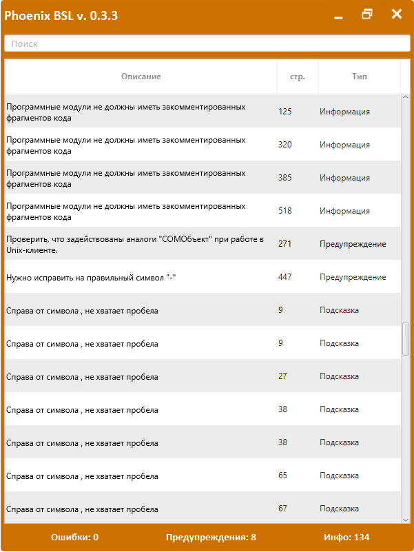

## Что это

**Phoenix BSL** — приложение для статического анализа кода на языке 1С (BSL). Проверяет код на соответствие стандартам разработки, находит потенциальные ошибки и проблемы производительности.

- Репозиторий: [github.com/otymko/phoenixbsl](https://github.com/otymko/phoenixbsl)
- Документация: [otymko.github.io/phoenixbsl](https://otymko.github.io/phoenixbsl/)

---

## Возможности

- Проверка кода в реальном времени
- Интеграция с конфигуратором 1С
- Настраиваемые правила анализа
- Подсветка проблемных мест в коде

---

## Установка

1. Скачайте последнюю версию с [GitHub Releases](https://github.com/otymko/phoenixbsl/releases)
2. Распакуйте архив в удобную директорию
3. Запустите `phoenixbsl.exe`

---

## Настройка

Phoenix BSL использует правила из проекта [BSL Language Server](https://1c-syntax.github.io/bsl-language-server/).

Для настройки правил создайте файл `.bsl-language-server.json` в корне проекта или укажите путь к файлу настроек в интерфейсе программы.

Пример файла настроек: [settingsBSL.json](file/settingsBSL.json)

---

## Использование

1. Запустите Phoenix BSL
2. Откройте конфигуратор 1С
3. Phoenix BSL автоматически подключится к активному окну конфигуратора
4. При редактировании модуля анализ выполняется автоматически
5. Проблемы отображаются в окне Phoenix BSL

---

## Рекомендации

- Запускайте Phoenix BSL при работе в конфигураторе
- Исправляйте найденные замечания перед помещением в хранилище
- Настройте правила под стандарты вашей команды
