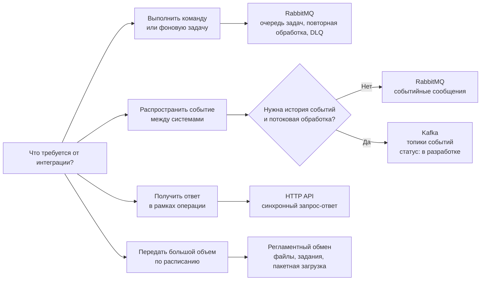

## Обзор

Брокеры сообщений используются для асинхронного взаимодействия между компонентами системы, обеспечивая надежную доставку сообщений и развязку сервисов.

## Поддерживаемые брокеры

- [RabbitMQ](rabbitmq/README.md) — основной брокер сообщений
- [Kafka](kafka/README.md) — в стадии разработки

## Принципы работы

1. **Именование** — строгое соблюдение [регламента именования](rabbitmq/naming.md) очередей, топиков и точек обмена
2. **Безопасность** — отдельные учетные записи для каждой системы с минимально необходимыми правами
3. **Версионирование** — версионирование форматов сообщений для обратной совместимости
4. **Мониторинг** — отслеживание состояния очередей и обработка ошибок

## Выбор типа интеграции

## Когда использовать брокеры сообщений

Брокеры сообщений подходят для:

- Асинхронной обработки задач
- Интеграции между микросервисами
- Обеспечения отказоустойчивости системы
- Масштабирования обработки сообщений
- Развязки компонентов системы

## Передача ссылок в JSON-сообщениях

При передаче ссылочных значений в JSON не извлекайте идентификатор ссылки вручную через отдельные промежуточные методы. Используйте единый проектный способ сериализации ссылок, чтобы пустые ссылки, типы значений и формат идентификаторов обрабатывались одинаково во всех сообщениях.

Для сообщений брокера обязательно фиксируйте:

1. формат представления ссылки;
2. правила передачи пустой ссылки;
3. версию схемы сообщения;
4. совместимость потребителей при изменении состава полей.
