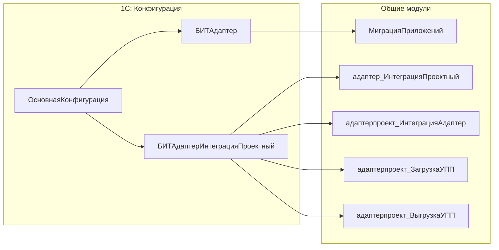

# БИТ.Адаптер

[БИТ.Адаптер](https://bit-erp.ru/adapter) — библиотека расширения для 1С:Предприятие, предназначенная для интеграции информационных систем на базе 1С с другими информационными системами (в т.ч. не 1С) с использованием RabbitMQ.

## Архитектура

БИТ.Адаптер состоит из двух частей:

1. **Основная библиотека** (`БИТАдаптер`) — общий функционал для работы с RabbitMQ
2. **Проектное расширение** (`БИТАдаптерИнтеграцияПроектный`) — переопределения для конкретных конфигураций



## Установка

### Добавление библиотеки

Добавьте submodule в репозиторий:

```cmd
git submodule add <ссылка-на-проект-в-git> "src/cfe/bit-adapter"
```

### Структура репозиториев

- **Основная библиотека** — общие изменения, которые влияют на адаптер
- **Проектные расширения** — переопределения для конфигураций хранятся в отдельном расширении для каждой конфигурации

## Настройка проектного расширения

В отдельном расширении добавьте `ОбщийМодуль.адаптер_ИнтеграцияПроектный` с кодом:

```bsl
#Область ПрограммныйИнтерфейс

Процедура ПриОпределенииМодулейСПодписками(МодулиСПодписками) Экспорт
    МодулиСПодписками.Добавить(адаптерпроект_ИнтеграцияАдаптер);
КонецПроцедуры

#КонецОбласти
```

Это добавит `ОбщийМодуль.адаптерпроект_ИнтеграцияАдаптер` как модуль с подписками на расширение функционала адаптера.

## Основные компоненты

### Каталоги

- **адаптер_ПараметрыПодключения** — параметры подключения к RabbitMQ
- **адаптер_ИсходящиеСообщения** — исходящие сообщения для отправки
- **адаптер_ВходящиеСообщения** — входящие сообщения для обработки
- **адаптер_СхемыДанных** — схемы данных для обмена
- **адаптер_ЗаписиРегистров** — записи регистров для обмена

### Обработки

- **адаптер_КомпонентаRabbitMQ** — компонента для работы с RabbitMQ
- **адаптер_ГрупповаяВыгрузка** — групповая выгрузка данных
- **адаптер_RMQ_HTTP_REST** — REST API для работы с RabbitMQ

### Общие модули

Основные модули для работы с обменом:

- `адаптер_НастройкиОбмена` — настройки обмена
- `адаптер_ОбменДаннымиXDTO` — обмен данными через XDTO
- `адаптер_ОбработчикиСобытий` — обработчики событий обмена
- `адаптер_РаботаСДаннымиИБ` — работа с данными информационной базы

## Подписки на события

Модуль `адаптерпроект_ИнтеграцияАдаптер` должен реализовывать следующие подписки:

- `ЗаполнитьВыгружаемыеОбъекты` — определение объектов для выгрузки
- `ПолучитьДанныеВыгружаемогоОбъекта` — получение данных объекта для отправки
- `ЗаписатьМассивДанных` — запись входящих данных в информационную базу
- `ЗаполнитьСоставВыгружаемыхОбъектов` — определение состава выгружаемых объектов
- `ЗаполнитьТекстыЗапросовУсловиями` — добавление условий в запросы выгрузки
- `ПолучитьИмяТекущейБазы` — получение имени текущей базы для идентификации

## Примеры использования

См. [Примеры использования](examples.md)

## Дополнительные ресурсы

- [Официальный сайт БИТ.Адаптер](https://bit-erp.ru/adapter)
