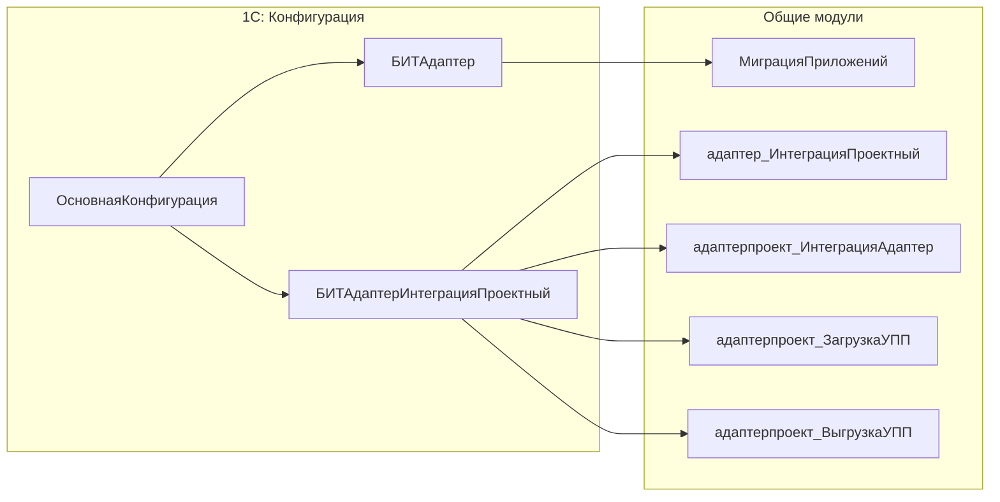

# БИТ.Адаптер

[БИТ.Адаптер](https://bit-erp.ru/adapter) — библиотека для 1С:Предприятие, предназначенная для интеграции информационных систем на базе 1С с другими информационными системами (в т.ч. не 1С) с использованием RabbitMQ.

## Архитектура

БИТ.Адаптер состоит из двух частей:

1. **Основная библиотека** (`БИТАдаптер`) — общий функционал для работы с RabbitMQ
2. **Проектное расширение** (`БИТАдаптерИнтеграцияПроектный`) — переопределения для конкретных конфигураций



## Установка

### Добавление библиотеки

Добавьте submodule в репозиторий:

```cmd
git submodule add <ссылка-на-проект-в-git> "src/cfe/bit-adapter"
```

Примеры подписок, весь список смотрите в основном коде адаптера.

## Примеры использования

Для изучения полных примеров реализации интеграции с БИТ.Адаптером используйте репозиторий: **[yellow-hammer/bit-adapter-example](https://github.com/yellow-hammer/bit-adapter-example)**

Репозиторий содержит:

- **`simple-bit-adapter-example`** — простой пример расширения с базовыми принципами работы
- **`acc-bit-adapter-example`** — пример для конфигурации БП КОРП Казахстан (выгрузка документов по ОС)
- **`cpm-bit-adapter-example`** — пример для конфигурации УХ (загрузка документов по ОС)

Каждый пример включает полную структуру расширения, модули с подписками на события и обработчики для выгрузки/загрузки данных.

### Рекомендации

1. **Модульная структура** — разделяйте логику по общим модулям: основная интеграция, работа с данными ИБ, модули для каждого источника
2. **Форматы сообщений** — используйте `JSONMobile` для компактных сообщений или `XML` для полной совместимости
3. **Фильтрация данных** — используйте `ЗаполнитьТекстыЗапросовУсловиями` для ограничения выгружаемых данных
4. **Настройка состава** — используйте `ОставитьРеквизиты`, `ДобавитьРеквизит`, `УдалитьРеквизит` для оптимизации объёма данных
5. **Обработка ошибок** — всегда возвращайте структурированный результат с полями `Успешно`, `ТекстОшибки`, `СобытиеСообщения`

## Дополнительные ресурсы

- [Официальный сайт БИТ.Адаптер](https://bit-erp.ru/adapter)
