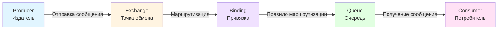
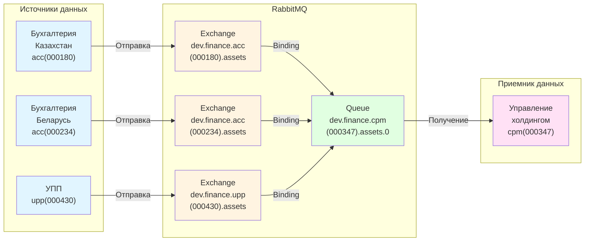
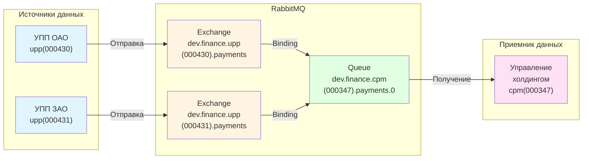
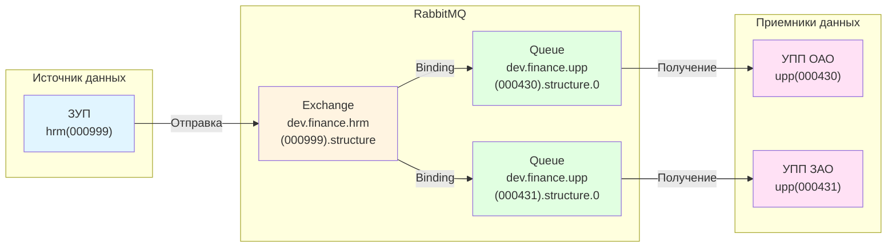

# Регламент именования

Этот документ разработан для доменов, занимающихся 1С, с учетом специфики работы с информационными базами и множественными доменами данных.

:::info Важно
Если настроены [виртуальные хосты](concepts.md#virtual-host-виртуальный-хост), используйте их вместо прямого указания контура в имени очереди/точки обмена!
:::

## Схема компонентов

Общая схема взаимодействия компонентов RabbitMQ:



## Пользователи

Каждой системе и каждому пользователю в любом контуре заводится отдельный пользователь с отдельным паролем, с человекочитаемым именем по формату.

### Формат имен пользователей

#### Для систем (prod/dev контуры)

```
<контур>.<идентификатор-системы>.service
```

**Примеры:**

- `dev.hrm.ru.service` — сервисная учетная запись для DEV контура системы 1С:Зарплата и управление персоналом
- `prod.upp.ao(0000340).service` — сервисная учетная запись для PROD контура базы УПП

#### Для пользователей (prod/dev контуры)

```
<идентификатор-пользователя-в-домене>
```

**Примеры:**

- `i.ivanov` — персональная учетная запись в домене "@company.local"

### Права доступа

При создании пользователей устанавливаются права, которые должны ограничивать чтение/запись только на те очереди/точки обмена, к которым данный пользователь относится.

Права в RabbitMQ задаются в виде регулярного выражения для каждого типа доступа: Configure, Write, Read.

#### Примеры настройки прав доступа

**Полный доступ для конкретной системы:**

Для пользователя `dev.upp.ao(0000340).service` устанавливаются права:

```
Configure: dev(?i).*upp.ao\(0000340\).*
Write:     dev(?i).*upp.ao\(0000340\).*
Read:      dev(?i).*upp.ao\(0000340\).*
```

**Только чтение из очередей:**

Для пользователя, который только потребляет сообщения:

```
Configure: ^$
Write:     ^$
Read:      dev(?i).*finance.*upp.*
```

**Только запись в exchange:**

Для пользователя, который только публикует сообщения:

```
Configure: dev(?i).*finance.*hrm.*
Write:     dev(?i).*finance.*hrm.*
Read:      ^$
```

#### Разбор регулярного выражения

Регулярное выражение `dev(?i).*upp.ao\(0000340\).*` означает:

1. Начинается с `"dev"` (регистрозависимо)
2. После `"dev"` идет любой текст (включая пустой) в любом регистре (из-за `(?i)`)
3. Содержит подстроку `"upp.ao"` (регистронезависимо, например, `UPP.AO`, `upp.Ao` и т.д.)
4. После `"upp.ao"` идет строка `"(0000340)"` (скобки являются частью текста)
5. После `"(0000340)"` может быть любой текст (или ничего)

:::warning Важно
Символы скобки в регулярных выражениях должны экранироваться обратным слэшем (`\(` и `\)`), чтобы выражение считалось за часть текста.
:::

## Маска Exchange

**Формат:**

```
<env>.<domain>.<configuration>(<idd>).<description>
```

Где `configuration` и `idd` относятся к **источнику** данных.

### Примеры Exchange

- `dev.finance.hrm(000999).structure`
- `dev.finance.acc(000180).assets`
- `dev.finance.acc(000234).assets`

## Маска Queue

**Формат:**

```
<env>.<domain>.<configuration>(<idd>).<description>.<version>
```

Где `configuration` и `idd` относятся к **приемнику** данных.

### Примеры Queue

- `dev.finance.upp(000430).structure.0`
- `dev.finance.upp(000431).structure.0`
- `dev.finance.cpm(000347).assets.0`

## Binding (Привязка)

Binding определяет правила маршрутизации сообщений от Exchange к Queue на основе routing key.

### Формат Routing Key от 1С адаптера

1С адаптер формирует routing key в формате:

```
<формат>.<ПолноеИмяОбъектаМетаданных>
```

Где:

- **формат** — `json`, `xml` или `all` (в зависимости от формата сообщения)
- **ПолноеИмяОбъектаМетаданных** — полное имя объекта метаданных 1С (например, `Справочник.Организации`, `Документ.ПринятиеКУчетуОС`)

:::info Приоритет формирования routing key
Схема с метаданными является **приоритетной** для формирования routing key. Однако, если метаданные недоступны, можно использовать альтернативную привязку через имя конфигурации и её идентификатор.
:::

#### Альтернативный формат Routing Key

Если метаданные недоступны, routing key может быть сформирован в формате:

```
<формат>.<configuration>(<id>)
```

Где:

- **формат** — `json`, `xml` или `all` (в зависимости от формата сообщения)
- **configuration** — имя конфигурации 1С (например, `hrm`, `upp`, `acc`)
- **id** — идентификатор информационной базы (например, `000999`, `000430`)

**Примеры альтернативного формата:**

- `json.hrm(000999)`
- `json.upp(000430)`
- `xml.acc(000180)`

### Примеры Routing Key

- `json.Справочник.Организации`
- `json.Справочник.ОсновныеСредства`
- `xml.Документ.ПринятиеКУчетуОС`
- `json.Документ.СписаниеОС`
- `json.РегистрСведений.ЗаписиРегистров`

### Типы Exchange и примеры Binding

#### Direct Exchange

Маршрутизация по точному совпадению routing key.

**Пример:**

```
Exchange: dev.finance.hrm(000999).structure
Queue: dev.finance.upp(000430).structure.0
Binding: routing key = "json.Справочник.Организации"
```

Сообщение с routing key `json.Справочник.Организации` будет доставлено только в очередь с таким же binding.

#### Topic Exchange

Маршрутизация по шаблону routing key с использованием специальных символов.

**Специальные символы:**

- `*` (звездочка) — заменяет одно слово (часть между точками)
- `#` (решетка) — заменяет ноль или более слов

**Примеры шаблонов:**

```
#.Справочник.Организации.#
```

Соответствует: `json.Справочник.Организации`, `xml.Справочник.Организации`, `all.Справочник.Организации`

```
json.#
```

Соответствует: `json.Справочник.Организации`, `json.Документ.ПринятиеКУчетуОС`, `json.РегистрСведений.ЗаписиРегистров`

```
#.Документ.#
```

Соответствует: `json.Документ.ПринятиеКУчетуОС`, `xml.Документ.СписаниеОС`, `all.Документ.ПередачаОС`

```
json.Справочник.*
```

Соответствует: `json.Справочник.Организации`, `json.Справочник.ОсновныеСредства`, но не `json.Справочник.Организации.Подразделения`

**Пример настройки:**

```
Exchange: dev.finance.hrm(000999).structure
Queue: dev.finance.upp(000430).structure.0
Binding: routing key pattern = "#.Справочник.Организации.#"
```

#### Fanout Exchange

Рассылка во все связанные очереди независимо от routing key.

**Пример:**

```
Exchange: dev.finance.hrm(000999).structure
Queue: dev.finance.upp(000430).structure.0
Queue: dev.finance.upp(000431).structure.0
Binding: без routing key
```

Все сообщения из exchange будут доставлены во все связанные очереди.

#### Headers Exchange

Маршрутизация на основе заголовков сообщения, а не routing key.

**Пример:**

```
Exchange: dev.finance.hrm(000999).structure
Queue: dev.finance.upp(000430).structure.0
Binding: headers = {"x-match": "all", "domain": "finance", "type": "structure"}
```

## Ключи и их возможные значения

| Ключ              | Значения                                            | Описание                                                                                                                                                                                            |
| ----------------- | --------------------------------------------------- | --------------------------------------------------------------------------------------------------------------------------------------------------------------------------------------------------- |
| **env**           | `prod`, `dev`, `stage`, `test`                      | Окружение: `dev` — разработка, `test` — тестирование, `stage` — тестирование с заказчиком                                                                                                           |
| **domain**        | `finance`, `hr`, `lc`, `ecomm`, `retail`            | Бизнес-домены                                                                                                                                                                                       |
| **configuration** | `cpm`, `lc`, `hrm`, `upp`, `aut`, `acc`             | Конфигурация 1С. Для УПП пишем просто `upp` без уточнения. Для Беларуси и Казахстана — `acc` (от слова accounting)                                                                                  |
| **idd**           | `000248`, `000431`                                  | Идентификатор информационной базы согласно списку идентификаторов из реестра компании                                                                                                               |
| **description**   | `assets`, `payments`, `structure`, `counterparties` | Краткое описание сущности передаваемых данных. Делим по доменам внутри информационной системы. Например, всю информацию об ОС можно объединить в `"assets"`, а информацию об оплатах в `"payments"` |
| **version**       | `0`, `1`, `5`                                       | Версия обмена, по умолчанию `"0"`                                                                                                                                                                   |

## Примеры использования

### Пример 1: Отправка данных по Основным средствам

**Задача:** Отправка данных по Основным средствам из бухгалтерии Казахстан, Беларусь и УПП в Управление холдингом.

**Решение:**

- Exchange: `dev.finance.acc(000180).assets`, `dev.finance.acc(000234).assets`, `dev.finance.upp(000430).assets`
- Queue: `dev.finance.cpm(000347).assets.0`



### Пример 2: Отправка платежных поручений

**Задача:** Отправка платежных поручений из УПП ОАО и УПП ЗАО в УХ.

**Решение:**

- Exchange: `dev.finance.upp(000430).payments`, `dev.finance.upp(000431).payments`
- Queue: `dev.finance.cpm(000347).payments.0`



### Пример 3: Отправка структуры предприятия

**Задача:** Отправка данных по структуре предприятия из ЗУП в УПП ОАО и УПП ЗАО.

**Решение:**

- Exchange: `dev.finance.hrm(000999).structure`
- Queue: `dev.finance.upp(000430).structure.0`, `dev.finance.upp(000431).structure.0`



## Рекомендации

1. **Используйте виртуальные хосты** — если они настроены, используйте их вместо указания контура в имени
2. **Следуйте регламенту** — строго придерживайтесь формата именования для обеспечения единообразия
3. **Версионирование** — при изменении формата сообщений увеличивайте версию в имени очереди
4. **Минимальные права** — предоставляйте пользователям только необходимые права доступа
5. **Документирование** — документируйте назначение каждой очереди и точки обмена

## Связанные документы

- [Основные концепции](concepts.md)
- [Обзор](README.md)
