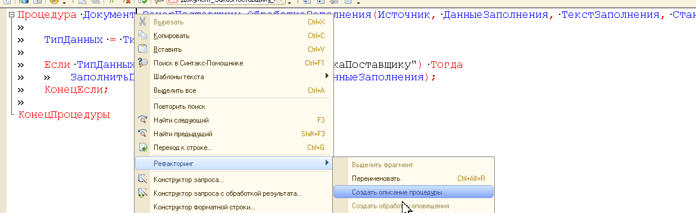
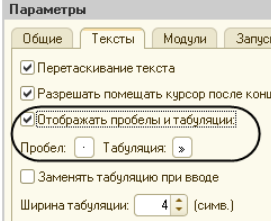

## Общие сведения

Раздел задает базовые правила оформления кода, модулей и прикладной логики. Если правило уже автоматизировано в `BSL Language Server`, `SonarQube` или другой проверке проекта, ручная проверка на review не отменяется: разработчик обязан исправлять как автоматические замечания, так и очевидные нарушения читаемости.

## Модули

Все модули (общие, формы, объекта, менеджера, команд) должны соответствовать стандартам:

- [Структура модуля](https://its.1c.ru/db/v8std/content/455/hdoc)

- [Поддержка толстого клиента, управляемое приложение, клиент-сервер](https://its.1c.ru/db/v8std/content/680/hdoc) (относится к модулю объекта и менеджера)

- В типовых объектах не должно быть наших процедур и функций, наш код должен быть расположен в [собственных общих модулях](https://its.1c.ru/db/v8std/content/469/hdoc).

- В обработчиках событий (`ПередЗаписью`, `ПриЗаписи`, `ОбработкаПроведения`, `ПриОткрытии`, `ПриЧтенииНаСервере` и т.п.) должен находиться только вызов целевых процедур/функций. Функциональный код выносится в отдельные методы.

- Для небезопасных вызовов (`Выполнить`, `Вычислить`) использовать только безопасные обертки и заранее согласованные механизмы платформы.

  Неправильно:

  ```bsl
  Результат = Вычислить(ТекстВыражения);
  ```

  Правильно:

  ```bsl
  Результат = ОбщегоНазначения.ВычислитьВБезопасномРежиме(
  	ТекстВыражения,
  	Новый Структура
  );
  ```

- Не выполнять интеграционные вызовы и длительные операции внутри открытых транзакций и обработчиков записи/проведения (`ПередЗаписью`, `ПриЗаписи`, `ОбработкаПроведения`). Внешние вызовы выносить в фоновую обработку, очередь или регламентное задание.

## Исключения и транзакции

1. `Попытка ... Исключение ... КонецПопытки` используется только для операций, ошибку которых нельзя надежно проверить заранее: работа с файлами, внешними компонентами, сетевыми ресурсами, внешними обработками и другими нестабильными границами.

2. Не используйте `Попытка` как замену обычной проверки значения. Например, приведение строки к числу должно выполняться через проверку или `ОписаниеТипов`, а не через подавление исключения.

3. Пустой блок `Исключение` запрещен. В блоке исключения должно быть одно из действий:
   - отмена транзакции;
   - запись диагностической информации в журнал регистрации;
   - возврат прикладного результата с понятным описанием ошибки;
   - повторный вызов исключения.

4. Если исключение перехватывается внутри транзакции, первым действием в блоке `Исключение` должна выполняться отмена транзакции.

5. Если ошибка должна быть передана во внешний обработчик, используйте `ВызватьИсключение;` без параметра. Так сохраняется исходный стек ошибки.

6. Для записи ошибки в журнал регистрации используйте подробное представление ошибки. Одного текста `ОписаниеОшибки()` недостаточно для диагностики сложных сбоев.

7. Не выполняйте внешние вызовы внутри транзакции. Если операция требует интеграции, очереди, сетевого запроса или длительной обработки, вынесите ее за границы транзакции.

## Строки

1. При длине строки более **140** символов следует использовать переносы. Строки длиннее **140** символов делать не рекомендуется, за исключением тех случаев, когда перенос невозможен (например, в коде определена длинная строковая константа, которая выводится без переносов в окно сообщений с помощью объекта СообщениеПользователю).

2. [Конкатенация строк может быть заменена на СтрСоединить или СтрШаблон](https://docs.checkbsl.org/checks/overall/StringConcat/)

   Вместо:

   ```bsl
   Процедура ВыводОшибки(НомерСтроки, ТипДанных)
       Результат = "Ошибка в данных в строке " + НомерСтроки + " (требуется тип " + ТипДанных + ")";
   КонецПроцедуры
   ```

   Использовать:

   ```bsl
   Процедура ВыводОшибки(НомерСтроки, ТипДанных)
       Результат = СтрШаблон("Ошибка в данных в строке %1 (требуется тип %2)", НомерСтроки, ТипДанных);
   КонецПроцедуры
   ```

## Имена методов и их описание {#method-names-and-their-descriptions}

1. Стандарт 1С [«Описание процедур и функций»](https://its.1c.ru/db/v8std/content/453/hdoc)

2. Стандарт 1С [«Правила образования имен переменных»](https://its.1c.ru/db/v8std/content/454/hdoc)

   **Важно:** не использовать сокращения переменных подобных примеру:

   масРеквизитов, соотвВидИмя, новСтр

3. [Имена процедур и функций](https://its.1c.ru/db/v8std/content/647/hdoc)

4. [Все методы программного интерфейса должны иметь описание](https://1c-syntax.github.io/bsl-language-server/diagnostics/PublicMethodsDescription/).

Это единственный «контракт» между разработчиками касающихся типизации. Для быстрого создания описания есть специальная возможность в конфигураторе:



1. [Имя функции не должно начинаться с «Получить»](https://1c-syntax.github.io/bsl-language-server/diagnostics/FunctionNameStartsWithGet/)

2. [Правильный выбор имен процедур и функций очень важен для повышения читаемости кода](https://its.1c.ru/db/v8std/content/647/hdoc)

## Запросы

1. [Оформление текстов запросов](https://its.1c.ru/db/v8std/content/437/hdoc)

2. Нужно стараться, чтобы каждая часть формируемого запроса могла быть открыта с помощью конструктора запросов

## Метаданные

1. [Имя, синоним, комментарий](https://its.1c.ru/db/v8std/content/474/hdoc)

2. [Имена объектов метаданных в конфигурациях](https://its.1c.ru/db/v8std/content/550/hdoc)

## Читаемость кода

### Избыточный верхний уровень условия Если...Тогда...Иначе

Для улучшения читаемости сделать условие в начале метода с выходом из метода с помощью Возврат.

### Сложные условия

Многострочные условия и цепочки проверок нужно выносить в переменные или отдельные методы с говорящими именами. Условие должно читаться как бизнес-правило, а не как набор технических сравнений.

Неправильно:

```bsl
Если ВидОперации = Перечисления.ВидыОпераций.Поступление
    ИЛИ ВидОперации = Перечисления.ВидыОпераций.Возврат
    ИЛИ ВидОперации = Перечисления.ВидыОпераций.Корректировка Тогда
```

Правильно:

```bsl
Если ОперацияТребуетКонтроляОстатков(ВидОперации) Тогда
```

### Уровень вложенности

Чем глубже вложенность условий, циклов и попыток, тем сложнее сопровождать код. Граничные случаи нужно обрабатывать в начале метода через ранний `Возврат`, а самостоятельные ветви логики выносить в отдельные процедуры и функции.

Не допускается скрывать основную ветку выполнения внутри нескольких уровней `Если`, `Для`, `Пока` и
`Попытка`.

### Повторное использование переменных

Не используйте одну переменную для разных смыслов внутри метода. Повторное присваивание допустимо, если переменная сохраняет одно и то же назначение.

Неправильно:

```bsl
Данные = ПолучитьДанныеДокумента(Ссылка);
Данные = Данные.Выгрузить();
```

Правильно:

```bsl
РезультатЗапроса = ПолучитьДанныеДокумента(Ссылка);
ТаблицаДокумента = РезультатЗапроса.Выгрузить();
```

### Необязательный комментарий

Оставляйте комментарий который имеет смысл и может помочь другим разработчикам.

### Присутствует «мертвый» код, пустой обработчик

Не должно быть закомментированного кода и пустых обработчиков.

### Проверка заполненности/пустоты коллекции

Для повышения читаемости проверку коллекции на заполненность/пустоту лучше выполнять через специальную функцию **ЗначениеЗаполнено** вместо использования сравнения количества коллекцию с нулем. [Правило](https://docs.checkbsl.org/checks/overall/FullEmptyCollection/)

### Разделение на логические сегменты

Пустые строки помогают разбивать код приложения на логические сегменты. Одной пустой строкой отделяются друг от друга методы и логические секции внутри метода для более удобного чтения.

### Одна инструкция на строку

Запрещено писать несколько инструкций в одну строку (например, `Если ... Тогда Возврат; КонецЕсли;`). Каждая инструкция оформляется с новой строки.

### Разделить выполнение и выборку/выгрузку результата запроса

Следует корректно отделять выполнение запроса от выборки или выгрузки его результата.

- Используйте выполнить для выполнения операций, которые не требуют немедленного получения результата, проверка на пустой результат запроса,возвращение нескольких пакетов, а также когда нужно выполнить какие-либо действия с результатом, например создать или уничтожить временную таблицу.

- Используйте выборку для больших наборов данных или когда нужна последовательная обработка

- Используйте выгрузку, когда нужно манипулировать данными как единым целым или когда объем данных небольшой

Правильный выбор между выборкой и выгрузкой может значительно повлиять на производительность вашего решения.

### Тексты запросов выносите в отдельные функции

Длинные запросы, больше обычной выборки с условием, стоит выносить в отдельную функцию. Код становится компактней, а для отладки текста запроса код модуля не нужен.

## Непечатные символы

Обязательно включить отображение непечатных символов. [ИТС: Отобразить непечатаемые символы](https://its.1c.ru/db/pub101advice/content/12/hdoc)



Для удобства рекомендуется использовать символ табуляции `│`

Рекомендуется снять флаг **Разрешить помещать курсов после конца**, чтобы не создать случайно множество лишних символов пробела.

Выравнивание по символам делается с помощью пробелов. Нельзя использовать Tab после первого значимого символа. В разных средах будет разъезжаться отображение.

Для облегчения рутины можно использовать инструмент для выравнивания [ones-formatting](https://github.com/leobrn/ones-formatting).

[Статья: Отступ с помощью табуляции, выравнивание по пробелам](https://dmitryfrank.com/articles/indent_with_tabs_align_with_spaces).
