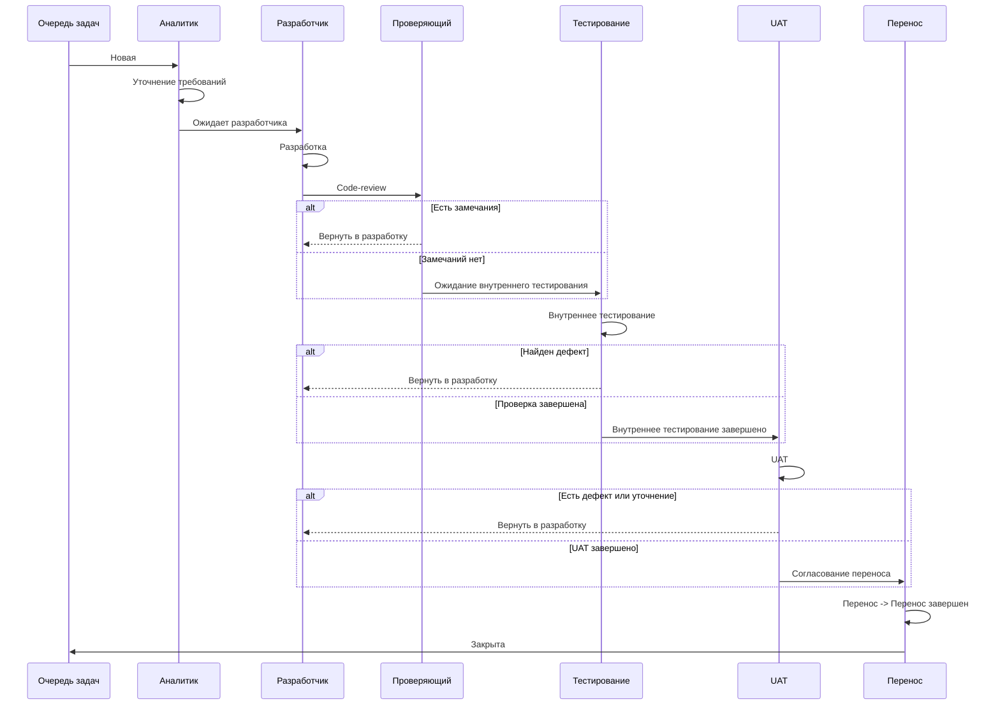

## Общие сведения

Задачи ведутся в корпоративной системе управления задачами. Статус задачи должен отражать фактическое состояние работы: постановку, разработку, проверку, тестирование, согласование переноса и завершение.

## Схема процесса

## Готовность к разработке

Перед переводом задачи в статус `Ожидает разработчика` должны быть зафиксированы:

1. цель изменения;
2. ожидаемое поведение;
3. затронутые объекты, контуры или интеграции;
4. критерии приемки;
5. ограничения по релизу, переносу или окружениям;
6. материалы для проверки, если они требуются разработчику или специалисту по тестированию.

## Правила возврата

1. Возврат из `Code-review`, внутреннего тестирования или `UAT` должен сопровождаться комментарием с причиной.
2. После исправления задача повторно проходит этап, с которого была возвращена.
3. Нельзя переводить задачу дальше, если обязательные замечания не закрыты.
4. Если замечание меняет постановку, аналитик уточняет требования до повторной разработки.
