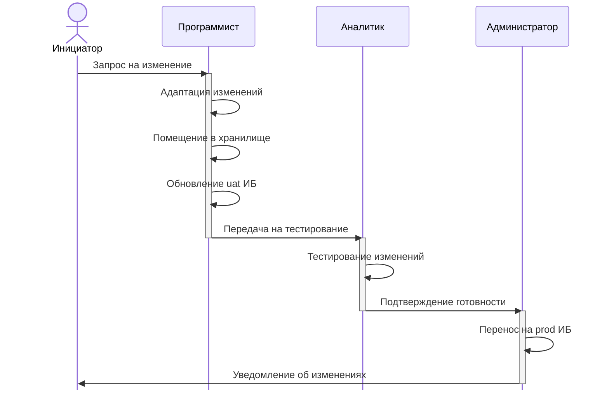

## Цель

Обеспечить безопасное, контролируемое и предсказуемое обновление конфигураций 1С в среде PROD.

## Роли и обязанности

- **Разработчик**:
  - Разрабатывает изменения в конфигурации.
  - Тестирует изменения в тестовой среде.
  - Подготавливает поставку.
- **Аналитик**:
  - Проверяет работоспособность изменений в тестовой среде.
  - Подтверждает готовность к переносу в PROD.
- **Администратор системы**:
  - Отвечает за перенос изменений в среду PROD.
  - Контролирует выполнение регламента обновления.
  - Выполняет резервное копирование перед обновлением.
- **Менеджер проекта**:
  - Утверждает изменения перед внедрением.
  - Контролирует соблюдение сроков и качества обновлений.

## Этапы обновления

## Примечания

1. Все изменения должны быть задокументированы в системе управления задачами.
2. Резервное копирование PROD базы является обязательным перед каждым обновлением.
3. При выявлении ошибок в работающем функционале, проблемные объекты должны быть отключены.
4. Обновление конфигураций в продуктивной среде выполняется только после успешного тестирования в тестовой среде.
