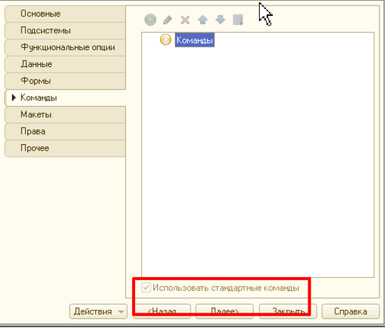
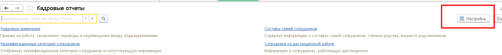

## Общие сведения

1. Отчеты должны быть подключены к подсистеме **БСП "Варианты отчетов”.**

   Как правило это в модуле **прфМодификацияКонфигурацииСервер** \*(убедиться, что модуль указан в ВариантыОтчетовПереопределяемый.НастроитьВариантыОтчетов)**\*:**

   ```bsl
   прфМодификацияКонфигурацииСервер.НастроитьВариантыОтчетов
   ```

2. Настройки отчета прописываются в модуле менеджера согласно документации **БСП**.

3. После подключения у отчета нужно убрать использование стандартных команд:

   

4. Не оставлять имя варианта отчета **Основной**.

5. Новый объект должен быть размещен в служебную подсистему согласно регламенту "[Подсистемы](subsystem.md)".

6. В свойствах отчета должно быть заполнено свойство "**Хранилище вариантов**".

7. \*Не забыть поднять версию после подключения отчета в **прфОбновлениеИнформационнойБазы.ПриДобавленииПодсистемы.\*** (Без поднятия версии новый отчет может не появиться в интерфейсе у пользователей после обновления, или могут возникнуть проблемы с его функционированием из-за отсутствия необходимых подготовительных действий).

8. Для отчета должна быть создана роль **прфПросмотрОтчета\<ИмяОтчета\>** согласно регламенту [Роли](roles.md).

9. Убедиться, что отчет появился в разделе отчетов автоматически.

10. Использование параметра **Период** должно быть **Всегда**. Запрет незаполненных значений = Истина.

11. Если в отчете несколько наборов данных нужно давать понятные наименования наборов. Требования такие же как к [переменным](../layout#method-names-and-their-descriptions).

    Неправильно:

    ```bsl
    ТаблИтоги1
    ТаблИтоги2
    НаборДанных1
    НаборДанных2
    ```

12. [Не забывать учитывать RLS](../request#consider-RLS-when-writing-queries)

13. Не использовать внешние отчеты и обработки, чтобы не нарушать цикл релиза в системе контроля версий (так как программисты часто под внешними отчетами и обработками скрывают **smell code**).

### Что делать если отчет не появился в подсистеме?

1. Проверить справочник **ПредопределенныеВариантыОтчетов** в пользовательском режиме и попытаться найти свой отчет. Если отчет есть, идем дальше по пунктам, если нет проблема в коде в подключение.

2. Убедиться, что имя варианта отчета в модуле менеджера соответствует имени в макете СКД на вкладке Настройки.

3. В разделе отчетов в нужной подсистеме проверить в настройках, что отчет есть и у него просто выключена видимость по умолчанию. Такое возможно из-за неудачных попыток добавления, на других базах при обновлении будет все хорошо.



## Кадровые данные в отчетах

При работе с кадровыми данными в отчетах в типовых конфигурациях нужно использовать механизм представлений:

1. [Статья: Введение в механизм представлений в ЗУП ред. 3](https://infostart.ru/1c/articles/841337/)

2. **[Файл: Пример отчета](file/testpredstavlenija.erf)**

3. [Статья: Представления "Кадровые данные”](https://www.myblog-1c.ru/%D0%BF%D1%80%D0%B5%D0%B4%D1%81%D1%82%D0%B0%D0%B2%D0%BB%D0%B5%D0%BD%D0%B8%D1%8F-%D0%BA%D0%B0%D0%B4%D1%80%D0%BE%D0%B2%D1%8B%D0%B5-%D0%B4%D0%B0%D0%BD%D0%BD%D1%8B%D0%B5/)

4. [Статья: Представление "Кадровая История Сотрудников”](https://www.myblog-1c.ru/%d0%bf%d1%80%d0%b5%d0%b4%d1%81%d1%82%d0%b0%d0%b2%d0%bb%d0%b5%d0%bd%d0%b8%d0%b5-%d0%ba%d0%b0%d0%b4%d1%80%d0%be%d0%b2%d0%b0%d1%8f-%d0%b8%d1%81%d1%82%d0%be%d1%80%d0%b8%d1%8f-%d1%81%d0%be%d1%82%d1%80/)

5. [Статья: Представления "Срез последних кадровой истории”, "Периоды”](https://www.myblog-1c.ru/%d0%bf%d1%80%d0%b5%d0%b4%d1%81%d1%82%d0%b0%d0%b2%d0%bb%d0%b5%d0%bd%d0%b8%d1%8f-%d0%bf%d0%b5%d1%80%d0%b8%d0%be%d0%b4%d1%8b-%d1%81%d1%80%d0%b5%d0%b7-%d0%bf%d0%be%d1%81%d0%bb%d0%b5%d0%b4%d0%bd%d0%b8/)

6. [Статья: "Представления "Данные о времени и состоянии сотрудников”](https://www.myblog-1c.ru/%D0%BF%D1%80%D0%B5%D0%B4%D1%81%D1%82%D0%B0%D0%B2%D0%BB%D0%B5%D0%BD%D0%B8%D1%8F-%D0%B4%D0%B0%D0%BD%D0%BD%D1%8B%D0%B5-%D0%BE-%D0%B2%D1%80%D0%B5%D0%BC%D0%B5%D0%BD%D0%B8-%D0%B8-%D1%81%D0%BE%D1%81%D1%82/)

7. [Представления, используемые в запросах наборов данных СКД отчетов.](https://its.1c.ru/db/metod81#content:7329:hdoc)

8. [Консоль запросов с поддержкой представления](https://infostart.ru/1c/tools/1149456/)

9. [Таблица доступных таблиц представления ЗУП](https://infostart.ru/1c/articles/942569/)
