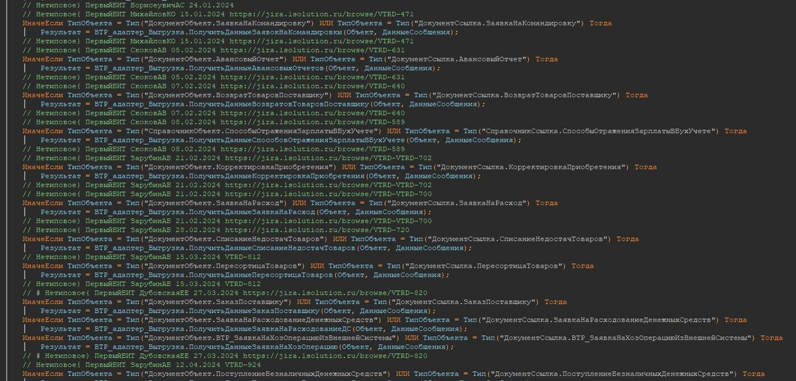

1. Каждый добавляемый объект метаданных должен содержать в своем наименовании префикс **прф**:

    ```txt
    // Шаблон
    прф<Наименование>

    // Примеры
    прфСотрудникиСервер
    прфСлужебныеНастройки
    ```

2. Синоним метаданных не должен содержать наш префикс.  Если нужно, чтобы новый объект отличался от типового т.к используется один и тот же синоним то используйте в конце наименования **(Расширенный).**

    ```txt
    Товары на складах (Расширенный)
    ```

3. Комментарий в коде типовых модулей должен иметь следующий вид:

    ```txt
    //<Фамилия автора> - начало изменения [(IR/CR <номер запроса>)] <дата изменения> {{
    КОД
    //}} <Фамилия автора> - конец изменения
    ```

    Шаблон начала комментарий:

    ```bsl
    // Иванов И.И. <?"", ДатаВремя, "ДФ=dd.MM.yyyy"> <?"Номер задачи"> {
    <?>
    ```

    Шаблон окончания комментарий:

    ```bsl
    <?>// }Иванов И.И. <?"", ДатаВремя, "ДФ=dd.MM.yyyy">
    ```

**[Шаблон.st](file/проект.st)**

4. Описания добавляемых процедур должны начинаться с:

    ```bsl
    // <Описание назначения процедуры/функции>
    // <Фамилия автора> [(IR/CR <номер запроса>)] <дата изменения>
    //
    ```

    Например:

    ```bsl
    //Функция преобразует строку в массив подстрок
    // Иванов И.И. COEFC1C-9978
    //
    // Параметры:
    // Стр  - Строка - Строка для преобразования
    // Разделитель - Строка - Разделитель подстрок (по умолчанию «;»)
    //
    // Возвращаемое значение - Массив  - Результат преобразования
    //
    Функция РазложитьСтроку(Знач Стр, Разделитель = «;»)
    ```

Комментарии (об изменении с фамилией и датой) в модулях и методах с префиксом **прф** не оставляются (актуально при использование систем контроля версий). Также не нужно оборачивать новые методы комментарием в начале и в конце, по желанию может быть заполнена информация о методе (Смотри пример модулей от 1С).

<details>
  <summary>Почему это важно?</summary>



**Снижается читаемости кода**

Большое количество таких комментариев, особенно в относительно небольших методах, процедурах или функциях, действительно может значительно затруднить чтение и понимание самого кода.

**Избыточность информации**

Современные системы контроля версий, уже отслеживают изменения в коде с указанием автора и даты. Дублирование этой информации в виде комментариев в самом коде избыточно.

**Быстрое устаревание информации**

При активной разработке код может меняться несколько раз в день разными разработчиками. В этом случае комментарии с фамилиями и датами очень быстро устареют и потеряют актуальность.

**Нарушение принципов чистого кода**

Современные методологии разработки, такие как принципы чистого кода, рекомендуют избегать излишних комментариев и стремиться к написанию самодокументируемого кода за счет осмысленных имен переменных, методов и т.д.

**Отвлечение внимания**

Большое количество таких комментариев может отвлекать внимание разработчика от самой логики кода при чтении и изучении программы.

</details>
