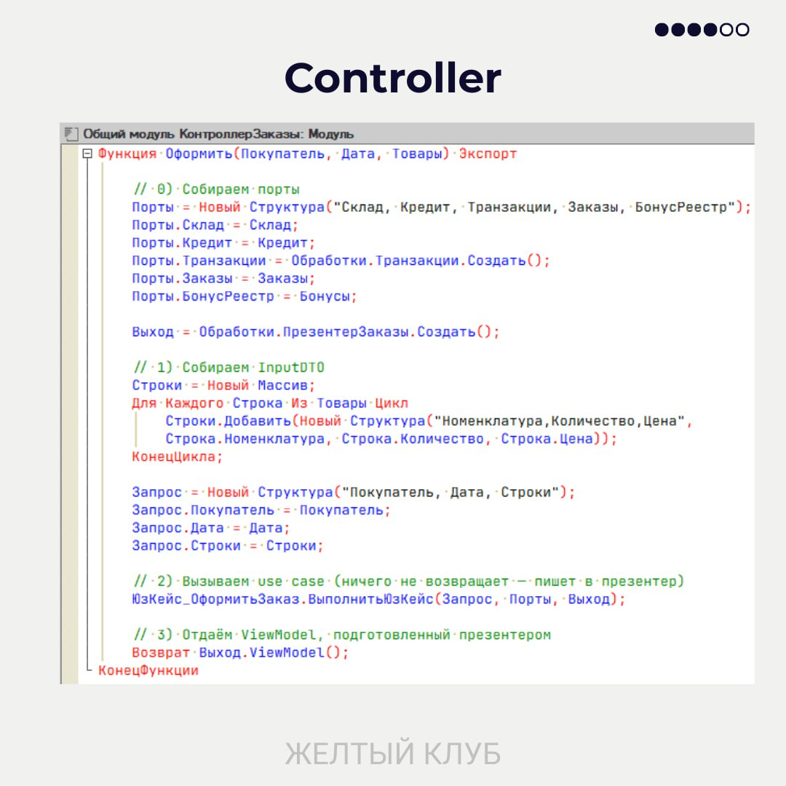

## Основные принципы

**Главное правило**: бизнес-правила — это центр системы. UI, БД и фреймворки — это детали, которые можно заменять без изменения бизнес-логики.

**Правило зависимостей**: все зависимости направлены внутрь, к бизнес-правилам. Внешние слои знают о внутренних, но не наоборот.

## Чистая архитектура в 1С

### Слои архитектуры

Слои располагаются от внешнего к внутреннему:

**Frameworks & Drivers** → **Interface Adapters** → **Use Cases** → **Entities**

### Entities (Сущности)

**Что это**: устойчивые бизнес-правила и инварианты, которые бизнес понимает без разговоров про таблицы и формы. Это плоские структуры и чистые функции, которые создают, проверяют и изменяют данные, обеспечивая выполнение инвариантов.

**Примеры инвариантов**:

- Количество ≥ 0 (целое для штучных товаров)
- Сумма = Цена × Количество (с учетом правил округления)
- Нельзя отгрузить больше доступного остатка

**Не путать с правилами use case**:

- ❌ «Не проводить заказ при долге > кредитного лимита»
- ❌ «Скидка > 15% требует утверждения»

**Размещение в 1С**: Общие модули. Только чистые функции и простые типы/структуры.

**Запрещено**: обращения к формам, ролям, `Запрос`, `ДокументОбъект`.

**Пример кода**:

На примере показаны функции создания артикула и проверки номенклатуры. Это чистые функции, работающие только со структурами.

### Use Cases (Бизнес-логика приложения)

**Роль**: координация шагов одной операции, использование Entities и портов.

**Примеры**: Оформить заказ, Начислить бонусы, Зарезервировать товар.

**Не делает**: не открывает формы, не пишет в БД напрямую, не знает про роли и сеанс.

**Вход/выход**: DTO — плоские структуры (`Структура` / `Соответствие` / `Массив`) без ссылок на формы, `ДокументОбъект`, регистры или метаданные.

**Размещение в 1С**: Общие модули.

:::tip Важно
Use case определяет контракты портов (интерфейсы), а реализация находится в адаптерах.
:::

**Пример кода — функция "Оформить заказ покупателя"**:

#### Шаг 1. Определение интерфейса и портов

Функция определяет RequestModel (входные данные), ResponseModel (результат) и порты (Склад, Кредит, Транзакции, Заказы, БонусРеестр).

#### Шаг 2. Валидация через Entities

Валидация строк и подсчет итоговой суммы выполняется через вызов функций из Entities. Все бизнес-правила вынесены в чистые функции.

#### Шаг 3. Проверка остатков через порт

Проверка доступности товара на складе выполняется через складской Gateway (порт). Use case не знает, откуда берутся данные — это ответственность адаптера.

#### Шаг 4. Применение политик и сохранение

Проверка кредитного лимита, расчет бонусов через Entities, сохранение заказа в транзакции через порты. В конце формируется ResponseModel с результатом.

### Interface Adapters (Адаптеры)

**Назначение**: мосты между внешним миром и ядром системы.

**Что размещаем**:

- **Controller**: преобразует UI/HTTP-ввод во входной DTO для use case
- **Presenter**: преобразует ответ use case в данные для формы/HTTP
- **Реализации портов**: работа с `Запрос`, `ДокументОбъект`, регистрами, HTTP, JSON
- **Соответствия**: преобразования DTO ↔️ платформенные типы/объекты

**Чего нет**: бизнес-правил и сценарной координации (они в Use Cases).

**Размещение в 1С**: Общие или прикладные модули.

**Пример кода Controller**:

Controller собирает все порты (Склад, Кредит, Транзакции и т.д.), преобразует данные формы в InputDTO (RequestModel), вызывает use case и возвращает ViewModel через презентер.

**Пример кода Presenter**:

Presenter преобразует результат use case (ResponseModel) в ViewModel для формы. Здесь решается, как показать успех или ошибку пользователю.

### Frameworks & Drivers (Формы и платформа)

**Роль**: доставить ввод/вывод без бизнес-логики.

**Что размещаем**:

- Обработчики команд формы, HTTP-эндпоинты, регламентные задания
- Обработчики событий: `ПередЗаписью`, `ОбработкаПроведения` и т.п.
- Сбор и первичная UI-валидация (обязательность, формат, маски)

**Чего не размещаем**: `Запросы`, `ДокументОбъект.Записать()`, работу с регистрами — это в Interface Adapters.

**Пример кода — обработчики формы документа**:

Обработчик команды формы документа. На клиенте собираются данные из реквизитов формы (Объект.Товары), на сервере вызывается Controller.

Обработка ответа от сервера: если успех — обновляем форму, если ошибка — показываем сообщение. Модификация данных происходит только после успешного выполнения use case.

## Другие архитектурные подходы

### Близкие к Чистой архитектуре

#### Гексагональная архитектура (Ports & Adapters)

- Четкие границы между слоями
- Зависимости направлены к use cases
- Внешнее взаимодействие через порты и адаптеры

#### Луковичная архитектура (Onion)

- Домен в центре
- Слои с инверсией зависимостей
- Внешние слои зависят от внутренних

#### BCE (Boundary–Control–Entity)

- Раскладывает код вокруг use case
- Boundary — интерфейсы к внешним исполнителям
- Control — координация сценария
- Entity — долгоживущие бизнес-объекты

#### Плагинная/микрокернел

- Тонкое ядро с бизнес-правилами
- Детали подключаются как плагины
- Фреймворк — это плагин к ядру, а не наоборот

#### DCI (Data–Context–Interaction)

- Отделяет «данные» и «поведение сценария» через роли и контексты
- Данные остаются простыми структурами
- Контекст определяет взаимодействие ролей в рамках use case

#### DDD (Domain-Driven Design, стратегический уровень)

- DDD отвечает на вопрос: что мы строим и где проходят смысловые границы
- Чистая архитектура показывает: как выстроить зависимости, чтобы ядро не зависело от деталей
- «Сущности Чистой архитектуры» — это вся доменная сердцевина, а не только «DDD-сущность»
- DDD и Чистая архитектура дополняют друг друга

### Приемлемые при правильном применении

#### Слоистая архитектура (n-tier)

- Приемлема, когда центр тяжести в домене, а не в БД/фреймворке

#### Event-Driven

- Если события — контракты на границах, а брокер — деталь

#### CQRS

- Уместно, когда разделение продиктовано use cases
- Часто сочетается с Event Sourcing

#### Pipe-and-Filter (конвейеры)

- Приемлемо, когда фильтры реализуют бизнес-политики
- I/O и способ доставки данных остаются деталями
- Хорошо подходит для потоковой обработки данных

### Топология, а не архитектура домена

Следующие подходы определяют способ развертывания и интеграции, но не структуру бизнес-логики:

- **Микросервисы / SOA / SCS** — модели деплоя и интеграции
- **Serverless/FaaS** — модель выполнения
- **MVC/MVP/MVVM / Flux/Redux** — паттерны презентационного слоя, микрофронтенды
- **Event Sourcing / Lake/Lakehouse / Lambda/Kappa / CDC/стриминг** — механика хранения и доставки данных
- **Actor/Reactive** — модель конкурентности/рантайма
- **Клиент-сервер, шина, брокер, P2P, space-based** — сетевые и инфраструктурные топологии

### Инструменты описания и управления архитектурой

Следующие подходы помогают документировать, принимать решения и эксплуатировать архитектуру:

**Модели представления архитектуры**:

- **C4** — иерархическая модель (Context, Containers, Components, Code)
- **4+1** — множественные представления (логическое, процессное, физическое, сценарии)

**Корпоративные фреймворки**:

- **TOGAF/Zachman** — рамки управления корпоративной архитектурой

**Принятие и проверка решений**:

- **ATAM** — метод анализа архитектурных компромиссов
- **ADR** (Architecture Decision Records) — документирование архитектурных решений
- **Fitness Functions** — автоматизированная проверка архитектурных характеристик

**Операционные принципы**:

- **12-Factor** — методология разработки облачных приложений
- **Cloud-Native** — принципы для устойчивых облачных сервисов

## Типичные архитектурные ошибки

:::tip Лозунг
**Форма — тонкая, use case — толстый, инфраструктура — заменяемая**
:::

### 1. Толстые формы

**Как распознать**:

- В обработчиках формы есть `Запрос = Новый Запрос(...)`, проверки бизнес-правил
- Утилиты в модуле формы: маппинг, форматирование дат/денег, локализация
- Форма сама координирует шаги: «резерв → бонусы → доставка»
- HTTP-запросы из формы
- «Болтливый» клиент–сервер: десятки мелких вызовов на сервер
- Побочные эффекты: создание документов, смена статусов прямо из формы

**Почему плохо**: Форма (UI) начинает диктовать бизнес-правила. Логика расползается по обработчикам, тестируемость и повторное использование падают.

**Как исправить**:

Правильный поток: **Форма → Контроллер → Use Case → Презентер → ViewModel → Форма**

- Форма не обращается ни к регистрам, ни к внешним сервисам
- Контроллер собирает входные данные и вызывает UC
- UC решает, что делать
- Презентер превращает результат в ViewModel для формы
- Один серверный вызов на действие пользователя (без «болтовни»)

### 2. Запрософилия («Запрос = бизнес-логика»)

**Как распознать**:

Инварианты и расчеты зашиты в тяжелых текстах запросов:

- Зашитые статусы: `ГДЕ Состояние В ("Подтвержден","Оплачен")`
- Сложные ветки `ВЫБОР` с бизнес-логикой
- Параметры запроса похожи на политику: `МаксДолг`, `ПорогБонуса`, `МинМаржа`

**Почему плохо**: Плохо тестируется, изменения ломают всё, правила теряются в языке запросов.

**Как исправить**:

- Правила — в UC. Запрос доставляет факты, UC принимает решения
- Из запроса убираем политику: никаких «МожноОтгрузить», не вычисляем «КлассКлиента», не вычисляем бонусы
- Запрос возвращает данные (остатки, суммы, статусы), а не вердикты

### 3. Запрос внутри Use Case

**Как распознать**: UC содержит текст запроса, напрямую обращается к регистрам.

**Почему плохо**:

- Смешение политики и данных
- Сложно заменить источник или оптимизировать запрос
- Тесты становятся тяжелыми

**Как исправить**: UC вызывает порт репозитория. Текст запроса размещается в адаптере.

### 4. `Сообщить()` на сервере

**Как распознать**: Серверная логика напрямую отправляет пользователю `Сообщить()`.

**Почему плохо**: Домен знает про UI, сценарии не тестируются, локализация — боль.

**Как исправить**:

- UC возвращает Result-модель: Успех/Ошибки/Предупреждения/Данные
- Презентер решает, как показать: сообщения, подсветки полей

### 5. Событийная лапша

**Как распознать**: Логика распределена по `ПередЗаписью`, `ОбработкаПроведения`, подпискам. Порядок выполнения неочевиден.

**Почему плохо**: Магия, неявные зависимости, сложно изменять и тестировать.

**Как исправить**:

- События — это только триггеры. События вызывают явный UC
- Координацию и последовательность шагов пишем вне обработчиков событий

### 6. Use Case вызывает Use Case

**Как распознать**: «ОформитьЗаказ» изнутри вызывает «НачислитьБонусы» как другой UC.

**Почему плохо**: UC превращается в оркестратор других UC, нарушается SRP, тесты усложняются.

**Как исправить**: Композицию нескольких UC выполняет уровень выше: контроллер/фасад/оркестратор.

:::note Различайте порт и UC

- «Начислить бонусы» как **порт** — это простая запись значения
- «Начислить бонусы» как **UC** — если есть правила, валидации, изменение статусов
  :::

### 7. Общие модули-синглтоны вместо инъекции

**Как распознать**: UC напрямую вызывает общие модули.

**Почему плохо**: Скрытые зависимости, сильная связанность, сложно тестировать и подменять.

**Как исправить**:

- Передавайте зависимости параметрами UC
- Обращение к общим модулям допустимо в контроллерах/адаптерах, но не в UC

:::caution Это же относится к
Настройкам, Константам и Параметрам сеанса
:::

## Рекомендации

1. **Начинайте с бизнес-правил** — определите инварианты и use cases до того, как думать о формах и таблицах.

2. **Держите формы тонкими** — они только собирают данные и отображают результат.

3. **Используйте DTO** — передавайте между слоями простые структуры, а не ссылки на объекты платформы.

4. **Тестируйте use cases** — они должны быть независимы от платформы и легко тестироваться.

5. **Изолируйте внешние зависимости** — используйте порты и адаптеры для работы с БД, HTTP, файлами.

:::tip Главное
Применяйте эти принципы соразмерно задаче. Не все проекты требуют полного разделения на слои, но понимание архитектуры поможет принимать правильные решения.
:::

---

## Благодарности

Материалы этого раздела поставлены по общедоступным материалам сообщества [**Желтый клуб**](https://t.me/yellowclub_official) — сообщества 1С программистов, объединяющего разработчиков, аналитиков и пользователей платформы 1С Предприятие.
