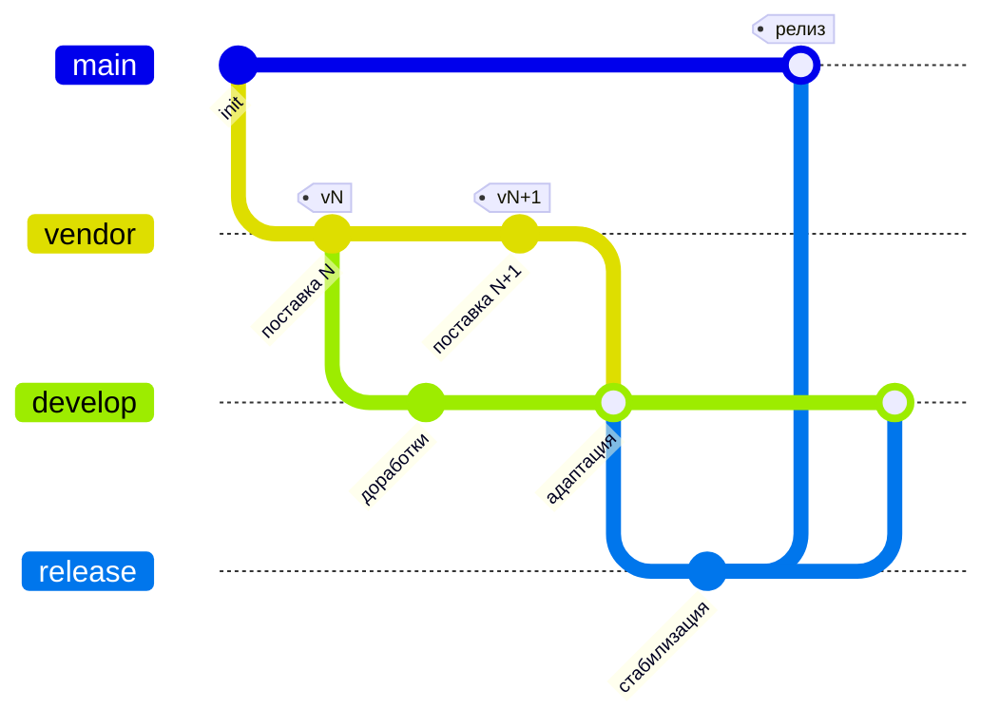

Обновление ведётся как трёхстороннее сравнение в git. Участвуют три версии конфигурации:

| Версия     | Что это                                        |
| ---------- | ---------------------------------------------- |
| **BASE**   | Поставка вендора предыдущей версии (чистая)    |
| **OURS**   | Ваш `develop` — поставка + доработки заказчика |
| **THEIRS** | Поставка вендора новой версии (чистая)         |

Сравнение с общим предком даёт две стороны: доработки заказчика (`OURS − BASE`) и изменения вендора (`THEIRS − BASE`). Непересекающиеся объединяются автоматически, пересекающиеся дают конфликт. Результат слияния — новый код вендора с заново наложенными доработками заказчика. Конфликты разрешает специалист 1С; ИИ-агент опционально ускоряет разрешение текстовых конфликтов — см. [Разрешение ИИ-агентом](#разрешение-ии-агентом-опционально).

Общим предком (`BASE`) должна быть чистая поставка вендора, а не доработки. Поэтому поставки ведут на отдельной ветке `vendor`: если новый релиз окажется поверх доработок, слияние пройдёт без конфликтов и затрёт доработанный функционал.

## Ветки

`vendor` — дополнительная долгоживущая ветка для чистых поставок вендора.



`develop` и `vendor` расходятся из одной точки — предыдущей поставки. Поэтому при `merge vendor` общий предок = чистая поставка.

## Создание ветки `vendor`

### Новый проект

Первую поставку размещают на `vendor`, а `develop` отводят от неё:

```bash
git switch --orphan vendor
# выгрузить чистую поставку в src/
git add -A && git commit -m "chore(vendor): поставка <версия>"
git switch -c develop
```

### Существующий проект

Если поставок в истории нет, общего предка с поставкой вендора тоже нет — его создают один раз. Чистую поставку текущей версии сохраняют в orphan-ветке `vendor` и привязывают к `develop` стратегией `ours`: она записывает поставку как общего предка, **не меняя код** `develop`.

```bash
git switch --orphan vendor
# выгрузить чистую поставку текущей версии в src/
git add -A && git commit -m "chore(vendor): поставка <версия>"

git switch develop
git merge -s ours --allow-unrelated-histories vendor \
  -m "chore(vendor): привязка линии поставки (база <версия>)"
```

После этого `develop` и `vendor` имеют общего предка — дальше обновление идёт обычным циклом.

:::tip Где взять чистую поставку
Конфигурация поставщика хранится в самой информационной базе. Сохраните её в файл: _Конфигурация → Поставка конфигурации → Сохранить конфигурацию поставщика в файл (`.cf`)_ — это и есть поставка текущей версии.
:::

:::note Альтернатива
Вместо привязки `-s ours` можно один раз переписать историю (`git replace --graft` / `git filter-repo`), сделав поставку корневым предком первого коммита. Это «чище» по графу, но требует force-push и пересоздания локальных копий у всей команды.
:::

## Цикл обновления

**1. Новая поставка на `vendor`:**

```bash
git switch vendor
# выгрузить новую поставку в src/
git add -A && git commit -m "chore(vendor): обновление до поставки <версия>"
```

**2. Ветка обновления и слияние:**

```bash
git switch develop
git switch -c update/vendor-<версия>
git merge --no-ff vendor      # общий предок = предыдущая поставка
```

**3. Бинарные конфликты** — нечитаемые файлы берём из новой поставки:

```bash
git diff --name-only --diff-filter=U \
  | grep -E '\.(bin|cf|epf|erf|zip|png|jpg|jpeg|bmp|ico|gif|svg)$' \
  | while read -r f; do git checkout --theirs -- "$f"; git add -- "$f"; done
```

**4. Текстовые конфликты** — разрешает специалист 1С (см. ниже); при необходимости ускоряется ИИ-агентом.

**5. Релиз** по [Git Flow](gitflow.md) (или другой методологии): проверка конфигурации в Конфигураторе, автоматизированные тесты, затем `release/*` → `main` с тегом. После релиза `vendor` влит в `develop`, и для следующей поставки общий предок = текущая поставка.

## Разрешение конфликтов

Конфликт возникает только там, где один и тот же объект изменили и вендор, и заказчик. Специалист 1С берёт новый код вендора за основу и заново накладывает доработанный функционал. Три версии каждого файла доступны напрямую: `git show :1:<path>` — BASE, `:2:` — OURS, `:3:` — THEIRS.

### Настройка (один раз)

```bash
git config merge.conflictStyle zdiff3   # в маркерах конфликта видно и BASE
git config rerere.enabled true          # повторные конфликты решаются автоматически
```

`zdiff3` показывает три секции — OURS, BASE, THEIRS — поэтому видно, что изменил вендор, а что заказчик:

```text
<<<<<<< ours — доработки заказчика (develop)
||||||| base — предыдущая поставка
=======
... новая поставка ...
>>>>>>> theirs — новая поставка
```

Разрешать можно текстом (в git) или в Конфигураторе — по типу объекта и привычке команды.

### Текстом

Модули (`.bsl`) и метаданные (`.xml`, `Form.xml`, `.html`) удобно разрешать в трёхстороннем merge-редакторе с секциями BASE / OURS / THEIRS:

- **VS Code** — встроенный merge editor;
- внешние KDiff3, Beyond Compare, P4Merge — подключаются как `git mergetool`.

Настроить VS Code как `git mergetool`/`difftool` (один раз):

```bash
git config --global merge.tool vscode
git config --global mergetool.vscode.cmd 'code --wait $MERGED'
git config --global diff.tool vscode
git config --global difftool.vscode.cmd 'code --wait --diff $LOCAL $REMOTE'
```

Нечитаемые (бинарные) файлы берут из новой поставки (`git checkout --theirs`). После разрешения — проверить, что маркеров не осталось:

```bash
git grep -nE '^(<<<<<<<|=======|>>>>>>>|\|\|\|\|\|\|\|)' -- 'src/**' || echo "маркеров нет"
```

### В Конфигураторе

Для обычных форм и сложных объектов (роли, командный интерфейс) может потребоваться штатное «Сравнение, объединение конфигураций».

Процесс без отключения текстового merge (git уже слил бесконфликтное построчно):

1. `git merge vendor` — git объединяет всё бесконфликтное; в рабочем дереве остаются только пересекающиеся конфликты.
2. Собрать `.cf` новой поставки (ветки `vendor`) скриптом сборки (Пакетный режим / OneScript / `ibcmd`) и загрузить текущую конфигурацию в базу разработки.
3. Конфигуратор → «Сравнение, объединение конфигураций» с этим `.cf`. В объединении остаются объекты, по которым в git ещё есть конфликты или которые удобнее править визуально.
4. Разрешить конфликты, выгрузить конфигурацию в файлы, сделать коммит изменений.

:::note Альтернатива: только через Конфигуратор
Если команда **не** разрешает конфликты текстом (и не использует ИИ-агента), в [`.gitattributes`](gitattributes.md) можно отключить текстовый авто-merge для дерева конфигурации:

```text
src/cf/** -merge
```

Тогда git не вписывает маркеры в файлы и не делает построчный merge: любой файл, изменённый с обеих сторон, помечается конфликтом целиком и остаётся пригодным для загрузки в Конфигуратор. Этот режим несовместим с разрешением конфликтов текстом и с [разрешением ИИ-агентом](#разрешение-ии-агентом-опционально).
:::

## Правила

- Чистые поставки — только на `vendor`. Поставку нельзя размещать поверх доработок: это ломает общий предок.
- При слиянии используйте `--no-ff`, чтобы сохранить точку слияния в графе истории.
- Бинарные объекты берут из новой поставки (`--theirs`), целостность проверяют в Конфигураторе.
- Развёртывание в промышленной среде — загрузка исходников, применение, миграция данных на новый релиз — по [регламенту обновления конфигураций](../../manuals/update_regulations.md).

## Разрешение ИИ-агентом (опционально)

Массовое разрешение **текстовых** конфликтов (`.bsl`, `.xml`, `Form.xml`, `.html`) можно ускорить ИИ-агентом (например, Claude Code): он читает три версии файла и переносит доработки заказчика в новый код вендора. Нечитаемые (бинарные) объекты агент берёт из новой поставки (`git checkout --theirs`) — там решение всегда однозначно. Агент **не заменяет специалиста** — он снимает рутину, а его правки специалист проверяет.

### Роли

| Делает       | Что именно                                                                                                                                                                      |
| ------------ | ------------------------------------------------------------------------------------------------------------------------------------------------------------------------------- |
| **Git**      | Механический построчный 3-way. Молча сливает непересекающиеся правки, оставляет маркеры только в спорных местах.                                                                |
| **ИИ-агент** | Разрешает текстовые конфликты: читает три версии, переносит доработки заказчика в новый код вендора, спорное помечает `MERGE-REVIEW`; нечитаемые файлы берёт из новой поставки. |
| **Человек**  | Проверяет правки агента; разбирает `MERGE-REVIEW`; финальная проверка конфигурации в Конфигураторе; тесты.                                                                      |

### Инструкции для агента

Инструкции рассчитаны на запуск ИИ-агента **в корне репозитория** в состоянии незавершённого merge.

**Установочная инструкция (контекст сессии — один раз в начале):**

```text
Ты помогаешь обновить доработанную конфигурацию 1С на новый релиз вендора, сохранив доработки.
Идёт незавершённый git-merge ветки поставки `vendor` в ветку обновления.

Три версии каждого конфликтного файла (через git):
- BASE   = чистая поставка предыдущей версии (общий предок), `git show :1:<path>`
- OURS   = develop: предыдущая поставка + доработки заказчика, `git show :2:<path>`
- THEIRS = новая поставка вендора, `git show :3:<path>`
В рабочем файле конфликты размечены в стиле zdiff3: секции ours / ||||||| base / theirs.

Цель для каждого файла: РЕЗУЛЬТАТ = новый код вендора (THEIRS) + ЗАНОВО НАЛОЖЕННЫЕ доработки
заказчика (то, что отличает OURS от BASE). Не откатывай логику вендора к старой и не теряй
доработки заказчика.

Алгоритм на файл:
1. Δ_заказчик = OURS − BASE  (что добавил/изменил заказчик).
2. Δ_вендор = THEIRS − BASE (что изменил вендор в релизе).
3. Возьми THEIRS за основу и перенеси в него Δ_заказчик:
   - заказчик ДОБАВИЛ процедуру/реквизит/подписку/строку → добавь в новую структуру вендора;
   - заказчик ИЗМЕНИЛ участок, который вендор тоже изменил → пойми НАМЕРЕНИЕ доработки
     и воспроизведи его поверх новой версии вендора;
   - изменения не пересекаются → объедини оба.

Жёсткие правила:
- Никогда не теряй доработки заказчика молча. Не уверен, как перенести — НЕ выбрасывай их.
- Сохраняй новый API и структуру вендора как основу.
- Не выдумывай код, которого нет ни в одной из трёх версий.
- Для .xml сохраняй валидность и правила 1С: состав и порядок реквизитов/табличных частей/форм,
  не ломай UUID и ссылки между объектами.
- Нечитаемые файлы бери из новой поставки: `git checkout --theirs -- <path>`.
- Дорабатываемый объект/метод исчез из новой поставки — доработку НЕ выбрасывай. Вендор мог
  переименовать объект или перенести код в другое место (другой модуль, другой метод). Найди,
  куда у вендора переехала эта логика, и наложи доработку там.
- Не удалось понять, что делать с изменением (в т.ч. не нашёл, куда вендор перенёс код) — НЕ
  разрешай файл: оставь маркеры, добавь `// >>> MERGE-REVIEW: <причина>`
  (для xml — `<!-- MERGE-REVIEW: ... -->`) и внеси файл в отчёт.

После успешного разрешения: убери маркеры и выполни `git add <path>`. Коммит не делай.
В конце пакета выдай отчёт: [разрешено N] [на ревью M с причинами].
```

**Инструкция разрешения (пакетами по списку файлов):**

```text
Разреши конфликты в этих файлах по нашему алгоритму. Бери пакетом по 15–25 штук,
начни с *Module.bsl:

<пути конфликтных файлов>

Для каждого файла кратко: что менял заказчик (OURS−BASE), что менял вендор (THEIRS−BASE),
применённое решение; затем `git add` или пометка MERGE-REVIEW. Где очевидно — не расписывай.
```

**Инструкция самопроверки (после всех пакетов):**

```text
Проверь свою работу:
1. Не осталось ли маркеров конфликта (<<<<<<<, |||||||, =======, >>>>>>>)? Найди и устрани.
2. Для .bsl: нет ли синтаксических разрывов — незакрытых Процедура/Функция, парных
   КонецЕсли/КонецЦикла, операторных скобок.
3. Для .xml: каждый изменённый файл — валидный XML, корневые теги и UUID на месте.
4. Сведи отчёт: сколько разрешено, полный список файлов на MERGE-REVIEW с причинами.
Файлы с пометкой MERGE-REVIEW не меняй — только перечисли.
```

### Что делает человек

- Разбирает файлы, помеченные агентом `MERGE-REVIEW` (агент их не трогает).
- Проверяет отсутствие маркеров конфликта (`git grep`, см. [Разрешение конфликтов](#разрешение-конфликтов)).
- Выполняет финальную проверку конфигурации в Конфигураторе и автоматизированные тесты.
